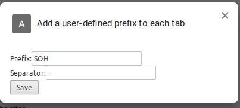

A Chrome plugin to add a user defined prefix to each tab, helps to differentiate
profiles and also organize profiles by desktop using a script (which is what I
use it for).

Unfortunately, there is no Chrome API to get the user profile, so this is the
next best thing. For example, in the screenshot below, I have configured the
prefix "SOH":


Using the extension options here:



To install:
```sh
git clone https://github.com/sohailsomani/chrome_custom_prefix_in_titlebar
cd chrome_ext_profile_in_titlebar
npm install
npm run build
```

This creates a `dist` directory.

Next:
* Go to `chrome://extensions` 
* Enable developer mode
* Click "Load unpacked extension"
* Navigate to the above `dist` directory
* Set the prefix as desired from the extension options 
* Enjoy

**NOTE**: You will have to either reload all your tabs or restart your browser
to get the prefix applied.
